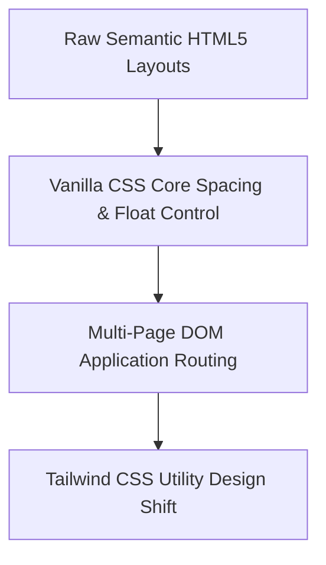

```markdown
# Suntech Assignments - Week 5: Frontend UI Core Foundations

Welcome to the documentation for the Week 5 frontend assignments. After establishing a strong foundation in backend development, this week marks our official transition into **Frontend User Interfaces (UI)**. 

The focus of this week is mastering structural semantic document structures using pure **HTML5** and **Vanilla CSS**, laying down the clean DOM foundations required before diving into JavaScript interactions and modern utility frameworks like Tailwind CSS.

---

## 📂 Week 5 Project Folder Structure

The frontend workspace is organized systematically by assignment targets to decouple structural markup definitions from aesthetic decoration sheets:

```text
Week5/
├── Assignment 1/
│   ├── index1.html   # Advanced multi-level nested list trees
│   └── index2.html   # Inline typographic markings & hyperlink systems
├── Assignment 2/
│   └── index.html    # Profile page composition using mixed semantic groupings
├── Assignment 3/
│   ├── index.html    # Black Goose Bistro semantic content alignment 
│   └── style.css     # Structural CSS resetting, spacing, and text typography
├── Assignment 4/
│   ├── index.html    # E-commerce promotional layout with inline assets
│   └── style.css     # CSS Box alignments, float wrapping, and layout clears
└── Assignment 5/     # Multi-Page Static Geographic Portal Application
    ├── Cities.html   # Central navigation map dashboard
    ├── banglore.html # Individual localized profile layout
    ├── chennai.html  # Individual localized profile layout
    ├── hyderabad.html# Individual localized profile layout
    ├── style.css     # Consolidated platform layout reset rules
    ├── style1.css    # Layout modifications (Theme 1)
    ├── style2.css    # Layout modifications (Theme 2)
    └── style3.css    # Layout modifications (Theme 3)

```

---

## 🛠️ The Developer Toolkit (Commands & Workflow)

Unlike previous weeks where we executed files via the Node.js V8 runtime engine (`node script.js`), frontend static files are compiled and rendered directly by the web browser's layout engine.

### Critical Local Workflow Protocols

* **Initializing Local Static Hosting:**
Instead of opening raw local disk paths (`file:///C:/...`), we utilized local development servers to serve pages over standard HTTP network protocols (`http://localhost`).
* **Active Hot-Reloading Command Integration:**
Using the **VS Code Live Server CLI / Extension**, code updates trigger automatic refreshes in the browser without losing state.

### How to Initialize and Run the Projects Locally

1. Open your terminal and verify your workspace path matches the project target root:
```bash
cd Suntech_Assignments/Week5

```


2. Launch your workspace directly inside your code editor:
```bash
code .

```


3. To serve the application, right-click on `Assignment 5/Cities.html` (or any target HTML index) and select **"Open with Live Server"**, or use your keyboard shortcut configuration:
* **Windows/Linux:** `Alt + L`, then `Alt + O`
* **macOS:** `Cmd + L`, then `Cmd + O`


---

## 🧠 What We Learned & Implemented

### 1. Document Structure & Core Mechanics

* **Standards-Mode Declarations (`<!DOCTYPE html>`)**: Learned how this tells the browser to parse code using strict HTML5 specifications rather than fallback quirks mode.
* **Responsive Viewport Scaling (`<meta name="viewport" ...>`)**: Mastered configuring dimensions to adapt automatically across variable device screens ($width = device-width$). This sets up our system architecture for upcoming mobile-first implementations in Tailwind CSS.

### 2. Semantic Document Structuring

* Learned how to organize document flows cleanly without breaking hierarchy using Heading hierarchies (`<h1>` through `<h4>`).
* Engineered deep categorization trees by structurally nesting distinct Unordered Lists (`<ul>`) cleanly within target List Item (`<li>`) parent configurations.
* Mixed sequencing controls (`<ol>`) and unstructured list tags (`<ul>`) side-by-side to handle complex data visualizations.

### 3. Box Modeling, Layout Controls, & Styling Rules

* **Box Reset Protocols**: Implemented clean page structural resets across stylesheets to prevent default browser layout distortions:
```css
body {
    box-sizing: border-box;
    margin: 0;
    padding: 0;
}

```


* **CSS Component Float Wrapping**: Mastered wrapping textual nodes dynamically around visual media assets using alignment rules (`float: left; margin-right: 20px;`).
* **Layout Clear Fixes**: Used blocking rules (`clear: both;`) on trailing elements to protect layouts from shifting upward under active floated containers.
* **Layout Centering Matrix**: Created responsive centered layouts by enforcing boundary maximum widths combined with symmetric margin spacing policies:
```css
.container {
    max-width: 600px;
    margin: 0 auto;
}

```


### 4. Multi-Page Architecture & Theme Decoupling

* Built a synchronized multi-page user network spanning across four interconnected documents (`Cities`, `Hyderabad`, `Bangalore`, `Chennai`).
* Mastered local application routing workflows using relative file links (`href="banglore.html"`).
* Demonstrated design decoupling by mapping multiple isolated style variations (`style1.css`, `style2.css`, etc.) against a single common HTML structure, proving that UI look-and-feel can change without altering underlying markup.

---

## 🗺️ Next Steps: The Tailwind CSS Transition

These core assignments establish a complete working baseline for manual DOM manipulation and layout assembly rules. This prepares our pipeline for the upcoming structural migration to utility-first layout frameworks:



By understanding manual operations like `margin: 0 auto`, `float: left`, and `color: #d17000`, we can confidently transition into rapidly prototyping professional modern designs using fast utility shorthand flags (like `mx-auto`, `float-left`, and `text-amber-600`) in **Tailwind CSS**.

```
***

```
