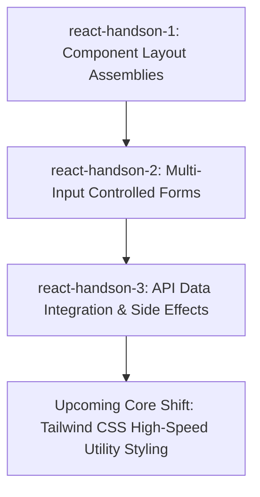

```markdown
# Suntech Assignments - Week 7: Component Lifecycles, Side Effects & API Synchronization (react-handson-3)

Welcome to the documentation for **Week 7 (react-handson-3)**. Having mastered controlled multi-input forms, dynamic lists, and child-to-parent prop flows in our second hands-on project, this assignment advances our frontend architecture into handling asynchronous operations. We explore managing structural side effects, hooking into external servers via API fetching, and handling component lifecycles using the core **`useEffect`** hook.

---

## 📂 Project Directory Structure

The project directory framework separates presentational layout elements from network-driven state layers:

```text
react-handson-3/
├── public/             # Static public assets (Favicons, branding layouts)
├── src/                # Core React Application Source Code
│   ├── assets/         # Project styles and local presentation sheets
│   ├── components/     # Network-driven components (Data Feeds, Loaders, Error UI)
│   ├── App.jsx         # App Orchestrator (Coordinates side effects & async data)
│   └── main.jsx        # App Mount Point (Binds React to index.html container)
├── .gitignore          # Rules mapping to exclude local node_modules/ & build dirs
├── eslint.config.js    # Strict static code analysis and syntax auditing rules
├── index.html          # Application mount shell
├── package.json        # Project metadata, build targets, and script configuration
└── vite.config.js      # Configuration properties for the ultra-fast Vite engine

```

---

## 🛠️ The Developer Toolkit (Commands & Workflow)

This project utilizes native network fetching APIs alongside standard Node Package Manager (`npm`) script lifecycles for application development.

### Essential Terminal Controls

* **Install Dependencies:**
Run this command immediately after setting up your repository to establish your local `node_modules` ecosystem:
```bash
npm install

```


* **Launch Hot-Module-Replacement Dev Server:**
Compiles code adjustments instantly into memory. Open your browser window to test live structural view adjustments over active network requests:
```bash
npm run dev

```


*Local development environment endpoint: `http://localhost:5173*`
* **Run Linting Code Audits:**
Scans files to catch background bugs, unhandled async expressions, or trailing variables:
```bash
npm run lint

```


* **Compile Optimized Cloud-Ready Build:**
Bundles, minifies, and tree-shakes JSX fragments down into optimized static files within the `/dist` directory:
```bash
npm run build

```


---

## 🧠 What We Learned & Implemented

### 1. Mastering Side Effects (`useEffect`)

* Learned how to separate pure UI rendering from external side effects (like data fetching, timers, or manual DOM updates).
* Mastered using the **Dependency Array** (`[]`) to control exactly when a side effect runs:
* *Empty Array (`[]`):* Runs the effect once when the component mounts, mimicking a traditional window load event.
* *With Dependencies (`[state]`):* Runs the effect dynamically whenever specific tracked values shift.


### 2. Asynchronous API Data Fetching

* Built dynamic connections to external REST API web services using native JavaScript asynchronous workflows (`fetch`, `async/await`).
* Moved away from hardcoded mock objects to process real-world JSON payloads across application components.

### 3. Comprehensive Network State UX Handling

* Implemented multi-state tracking variables to manage asynchronous lifecycles gracefully and keep users informed:
* **Loading States:** Displays animated loader screens or indicators while network requests are in-flight.
* **Success States:** Automatically maps and loops through data tables or card blocks once a valid response arrives.
* **Error States:** Uses defensive try/catch blocks to intercept network crashes or invalid responses, displaying user-friendly error messages without breaking the UI.


---

## 🗺️ Next Steps: Ready for production styling

Mastering asynchronous side effects completes the core logical requirements for building data-driven modern web applications. Your pipeline is now fully prepared to scale into production-grade design systems:



```
***

### 💡 Core Engineering Checklist for This Unit
When writing side effects inside a `useEffect` block, always wrap your network calls in a clean `try/catch` block. This prevents unhandled promise rejections from freezing your application and allows you to catch and handle API downtime gracefully.

```
