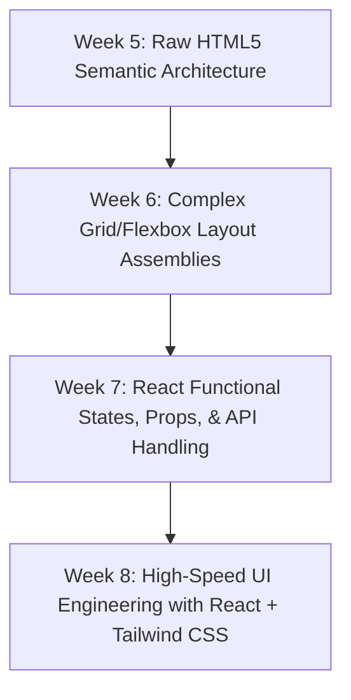

```markdown
# Suntech Assignments - Week 8: Advanced React Data Systems & Tailwind CSS Integration (react-products-app)

Welcome to the documentation for **Week 8 (react-products-app)**. This project acts as the capstone integration phase for our frontend development track. We have merged the complex asynchronous state lifecycles and API processing patterns from Week 7 with the utility-first design philosophies of **Tailwind CSS** to construct a highly performant, fully responsive, and beautifully styled dynamic product catalog interface.

---

## 📂 Project Directory Structure

The internal workspace decouples design layouts, utility styling layers, and reactive async components cleanly:

```text
react-products-app/
├── public/             # Static multi-media assets and branding assets
├── src/                # Core Application Source Code Tree
│   ├── assets/         # App-wide global presentation models
│   ├── components/     # Atomic UI Elements (Product Cards, Search Bars, Shimmer Loaders)
│   ├── index.css       # Core Tailwind directives mapping and base layer configuration
│   ├── App.jsx         # App Root Orchestrator (Coordinates search queries & product lists)
│   └── main.jsx        # App Bootstrapper (Mounts the application via virtual DOM)
├── .gitignore          # Version control ignore lists for node_modules/ & build outputs
├── eslint.config.js    # Strict static code analysis and syntax auditing rules
├── index.html          # Application anchor template mount point
├── package.json        # Manifest dependencies tracking React, Vite, and Tailwind
├── tailwind.config.js  # Custom utility theme extensions, padding bounds, & breakpoints
└── vite.config.js      # Build pipeline configurations for fast HMR compilation

```

---

## 🛠️ The Developer Toolkit (Commands & Workflow)

This project runs on the Vite building engine and uses the Node Package Manager (`npm`) to process framework lifecycles and build pipelines.

### Essential Terminal Controls

* **Install Project Core Packages:**
Execute this immediately upon configuring your repository to download and link all required operation frameworks:
```bash
npm install

```


* **Launch the Local Development Server:**
Compiles the source code directly into memory with active Hot Module Replacement (HMR). Code changes display in real time without refreshing the page:
```bash
npm run dev

```


*Open your web browser and navigate to the local network port: `http://localhost:5173*`
* **Execute Code Quality Audits (Linting):**
Scans all components to catch background bugs, unhandled async expressions, or broken structural rules:
```bash
npm run lint

```


* **Compile the Project for Production:**
Bundles, minifies, and tree-shakes your React architecture and styles down into dense, highly performant vanilla assets inside a static `/dist` directory for cloud hosting:
```bash
npm run build

```


---

## 🧠 What We Learned & Implemented

### 1. The Tailwind CSS Utility Design Shift

* **Eliminating Vanilla CSS Boilerplate:** Moved away from writing thousands of lines of external `.css` class declarations or debugging complex `float` clear-fixes.
* **Rapid Component Prototyping:** Utilized utility shorthand class properties embedded directly inside JSX code templates to style items natively in real-time:
* *Layout Grid:* `grid grid-cols-1 md:grid-cols-3 lg:grid-cols-4 gap-6`
* *UI Aesthetics:* `bg-white shadow-md rounded-lg hover:shadow-xl transition-shadow`


### 2. State-Driven Live Search & Dataset Filtering

* Integrated controlled search input elements that update internal search state tokens during user typing events (`onChange`).
* Utilized client-side string processing engines to smoothly filter out and map down targeted datasets matching lowercased queries on-the-fly, ensuring rapid user feedback transitions.

### 3. Graceful Asynchronous State Handling

* Continued mastery of handling component lifecycles using the `useEffect` hook to fetch data asynchronously from open APIs.
* Implemented production-grade loading and boundary states:
* **Shimmer/Skeleton Layout UI:** Developed fluid placeholder loading layouts using Tailwind animation markers (`animate-pulse`) to prevent layout shifting during server delays.
* **Empty State Routing:** Programmed conditional UX warnings if searches yielded zero product matches, allowing users to safely reset search configurations.


### 4. Enterprise Responsive Design Foundations

* Built dynamic, mobile-first layouts without touchpoints by defining layout grid tracks that adapt across form-factor dimensions seamlessly via native inline breakpoints (`sm:`, `md:`, `lg:`).

---

## 🗺️ Completed Frontend Milestones

This project marks the final structural evolution of your frontend logic track. You have moved completely from raw, unstyled markup trees to an interactive, fully stylized, server-synchronized frontend application:



---

```

```
